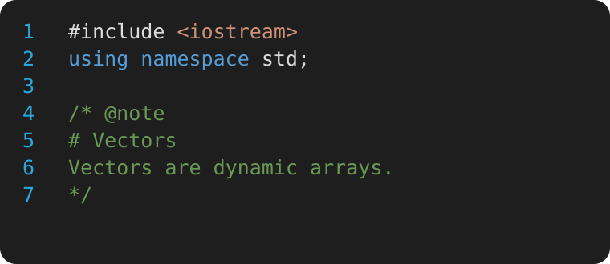
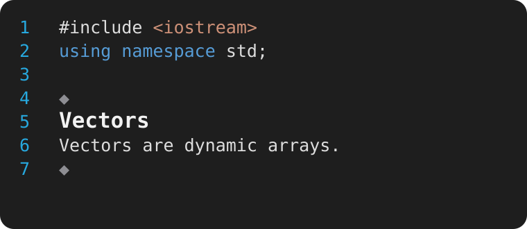
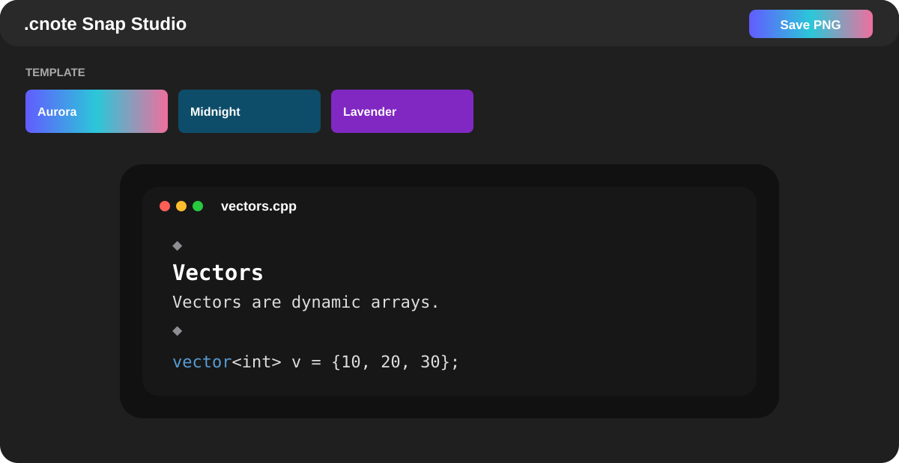

<p align="center">
  
</p>

<p align="center"><b>Write code like notes — without leaving your real source file.</b></p>

<p align="center">
  Inline visual Markdown · Notebook · Review · PDF export · Snap Studio · Workspace notes
</p>

<p align="center">
  <a href="downloads/codenote-6.1.1.vsix"><b>⬇ Download .cnote 6.1.1 for VS Code</b></a>
</p>

## Support the project 🎮

.cnote is free and open source. If it saves you time, helps you learn, or makes your code notes less ugly, you can support the project.

<p align="center">
  
</p>

<p align="center"><b>Buy me a PS5 🥺🎮</b><br/>No pressure. Every small contribution helps me keep building weirdly useful stuff.</p>

---

## What .cnote does

.cnote lets you write Markdown-style notes inside legal comments in normal source files. When your caret leaves the note, the Markdown syntax becomes a clean visual note **inside the same editor**. Click back into it and the real source returns for editing.

Your file stays `.cpp`, `.py`, `.java`, `.js`, `.ts`, `.go`, `.rs`, and so on. Compilers, Git, IntelliSense and debuggers still see ordinary source code.

### Raw source → inline visual note

<table>
<tr><th>While editing</th><th>When you return to code</th></tr>
<tr><td></td><td></td></tr>
</table>

V6 keeps the **same physical line count** in both states. The comment opener and closer become configurable boundary markers instead of disappearing, so diagnostics and breakpoints do not feel shifted.

## V6.1 editor workflow

The editor title is intentionally small now. `.cnote` only adds three quick actions:

- **Note** — insert a note
- **Snap** — open Snap Studio
- **.cnote** — open the compact action menu

The `.cnote` menu contains:

- **Notebook** — read code + notes from the current file
- **Review** — open due quizzes and checkpoints
- **Find Notes** — search the workspace
- **Export PDF**
- **Workspace Stats**
- **Settings**

`.cnote` no longer adds a Run button to the editor title, so it does not compete with the Run action from C/C++, Python or other language extensions.

Keyboard shortcuts remain optional:

| Action | Windows/Linux | macOS |
|---|---|---|
| Insert note | `Ctrl + Shift + F6` | `Cmd + Shift + F6` |
| Notebook | `Ctrl + Shift + F7` | `Cmd + Shift + F7` |
| Snap Studio | `Ctrl + Shift + F10` | `Cmd + Shift + F10` |

## Markdown that works inline

Write normal Markdown inside a CodeNote block. .cnote removes the syntax in visual mode and keeps the meaning.

| You write | Visual result |
|---|---|
| `# Vectors` | **Vectors** — large heading |
| `## Vector operations` | **Vector operations** — medium heading |
| `### push_back()` | **push_back()** — small heading |
| `**dynamic array**` | **dynamic array** |
| `*important*` | *important* |
| `` `O(1)` `` | `O(1)` |
| `- push_back()` | `• push_back()` |
| `- [ ] revise vectors` | `□ revise vectors` |
| `- [x] arrays done` | `✓ arrays done` |
| `> remember this` | `│ remember this` |
| `question: What is size()?` | **Question · What is size()?** |
| `answer: number of elements` | `Answer · number of elements` |

Example:

```cpp
#include <vector>
using namespace std;

/* @definition
# Vectors
Vectors are **dynamic arrays**.
*/

int main() {
    vector<int> v = {10, 20, 30};
}
```

## Note types

Use the type that matches what you are writing:

`@paragraph` · `@note` · `@section` · `@definition` · `@warning` · `@complexity` · `@quiz` · `@checkpoint` · `@tip` · `@example` · `@todo`

Example quiz:

```cpp
/* @quiz
question: What is the last index when size is 10?
answer: 9
*/
```

## Same-line-count inline mode

This source:

```text
/* @note
# Vectors
Vectors are dynamic arrays.
*/
```

still occupies four visible rows in inline mode:

```text
◆
Vectors
Vectors are dynamic arrays.
◆
```

The boundary is customizable in **.cnote Settings**:

- `◆`
- `✦`
- `●`
- `▸`
- `📘`
- any short custom symbol
- line style: `╭─` / `╰─`
- no marker

You can also show the note type beside the opening marker.

## Snap Studio

Select code, or leave nothing selected to capture the visible editor, then open **Snap**.

<p align="center"></p>

V6.1 changes Snap into a preview-first workflow:

- the code preview is visible immediately when Snap opens
- visual `.cnote` notes are rendered in the preview instead of raw `/* @note ... */` syntax
- **Save PNG** stays pinned at the top-right
- templates are a compact horizontal strip
- advanced controls stay out of the way until needed
- template, width, spacing, font size, line numbers, window dots and branding are remembered between sessions
- 8 built-in templates: Aurora, Midnight, Sunset, Forest, Paper, Minimal, Ocean and Lavender
- 2× PNG export

## Notebook

Notebook is the reading/navigation view for annotated files. It keeps normal code and visual notes in source order without positioning `.cnote` as a student-only feature.

Features include:

- note filtering and navigation
- quizzes and checkpoints
- `Again / Hard / Good / Easy` review state
- Markdown export
- PDF export
- jump back to exact source location
- workspace note search and tags

The `.cnote` Activity Bar also acts as the primary notebook index:

- **This File**
- **Workspace**
- **Review**
- **Tags**

## Settings panel

Open **.cnote → Settings** from the editor toolbar menu, use the Notebook sidebar gear, or run `CodeNote: Settings`.

You can change:

- automatic inline visual mode
- kind labels
- tags
- render delay
- note boundary style
- custom boundary symbol
- boundary type label
- Snap default template
- Snap line numbers
- Snap branding

Settings are stored in VS Code user settings. Snap Studio's live design choices are also remembered automatically.

## Branding

V6.1.1 adds the dedicated `.cnote` app icon used by VS Code's Extensions view and Marketplace package. Release builds generate and package the PNG automatically so local installs and published builds use the same identity.

Publisher metadata now uses `gurtejhundal` instead of the temporary `local-dev` identifier.

## Language support

.cnote uses native comment syntax for supported languages. C/C++/Java/JavaScript/TypeScript/Go/Rust use block comments, Python/Ruby/Shell/YAML use line-comment blocks, HTML/XML use HTML comments, and many more VS Code language IDs are supported.

Plain JSON is intentionally not supported because JSON has no legal comments. Use JSONC when you need annotations.

## Install

1. [Download `codenote-6.1.1.vsix`](downloads/codenote-6.1.1.vsix).
2. Open VS Code.
3. Open **Extensions**.
4. Click `…` → **Install from VSIX…**.
5. Choose the file and reload VS Code.

## Repository structure

```text
src/        TypeScript source
out/        compiled extension
media/      icon and README assets
scripts/    deterministic release asset generators
sample/     example annotated source files
```

## License

MIT

<p align="center"><b>.cnote</b> — code · note · learn · share</p>
