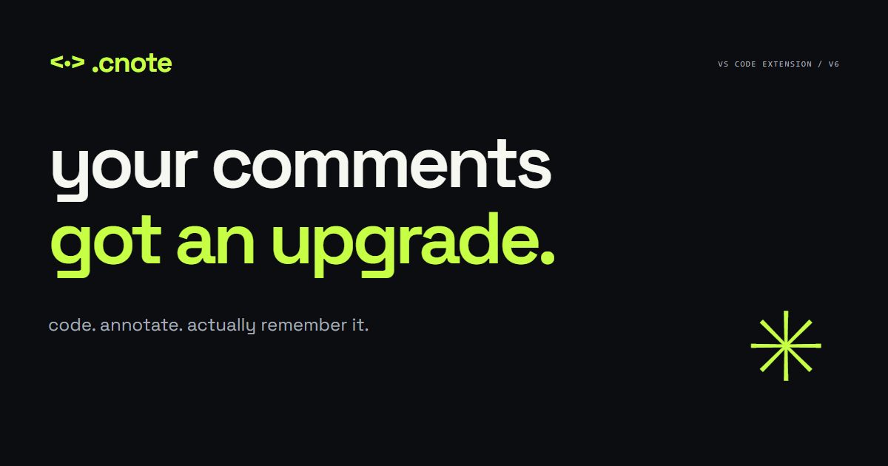
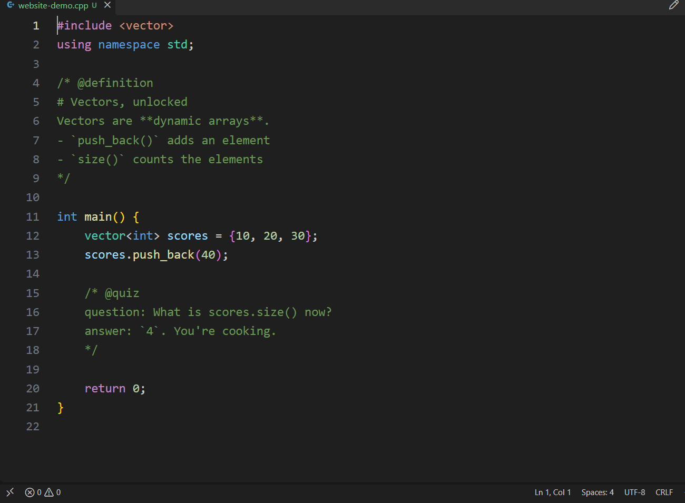
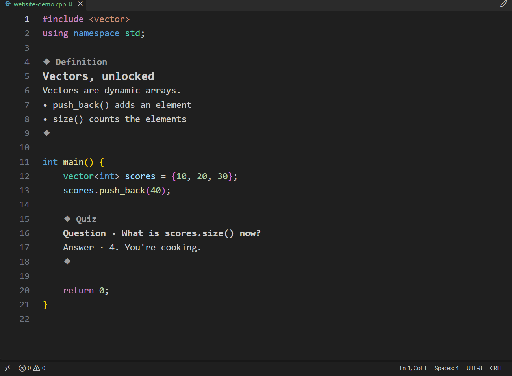
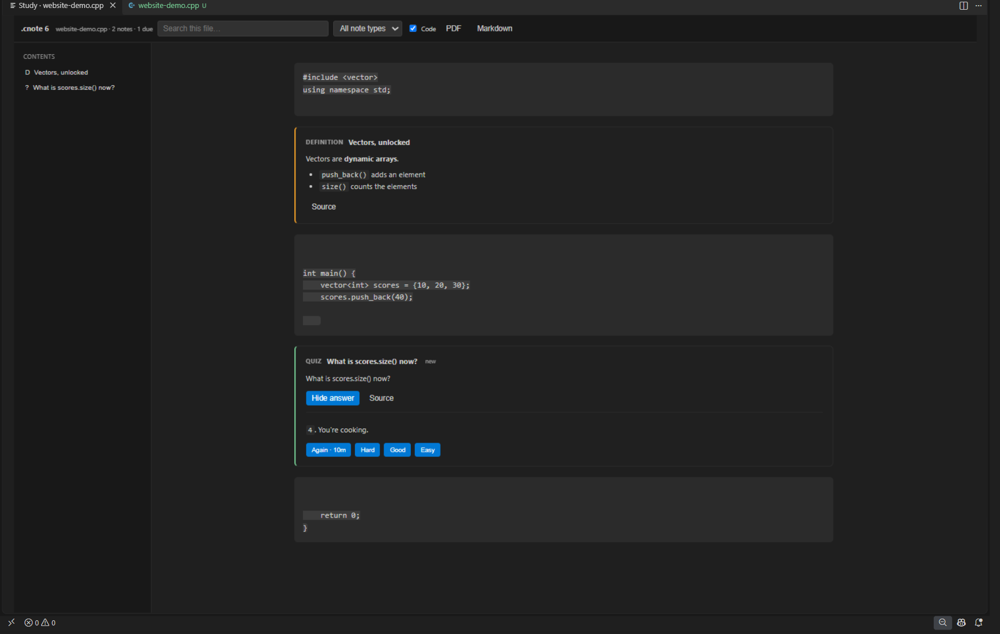
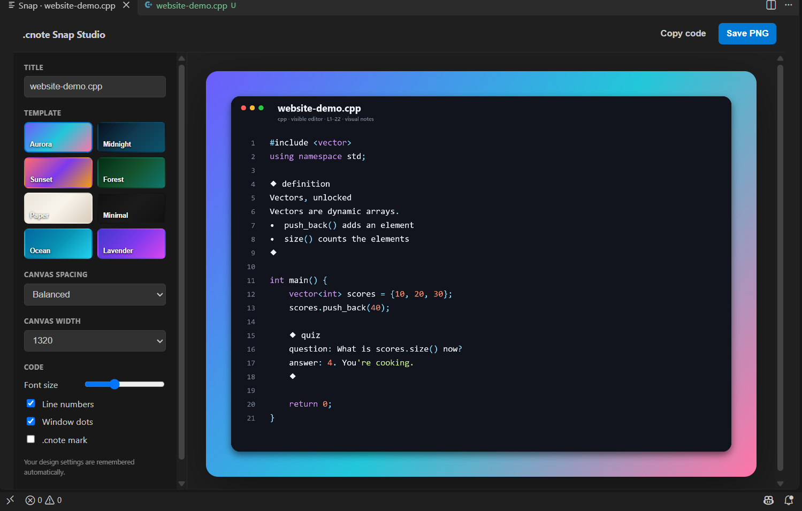
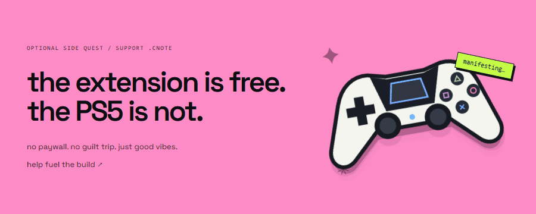

<p align="center"></p>

<p align="center"><b>your code is cooking. your notes should be too. ✨</b><br>Markdown-style study notes inside real source comments. Same file. Way less brain fog.</p>

<p align="center">
  <a href="https://gurtejhundal.github.io/.cnote/"><b>🌐 the website</b></a> &nbsp; · &nbsp;
  <a href="https://marketplace.visualstudio.com/items?itemName=gurtejhundal.codenote"><b>⬇ grab .cnote</b></a> &nbsp; · &nbsp;
  <a href="#the-extension-is-free-the-ps5-is-not-"><b>🎮 the side quest</b></a>
</p>

<p align="center"><code>VS Code ≥ 1.90</code> &nbsp; <code>MIT licensed</code> &nbsp; <code>no account</code> &nbsp; <code>local editor features</code></p>

---

## download here 👇

<p align="center">
  <a href="https://github.com/Gurtejhundal/.cnote/raw/refs/heads/main/downloads/codenote-7.1.7.vsix"></a><br>
  <a href="https://marketplace.visualstudio.com/items?itemName=gurtejhundal.codenote"><b>👇 Install .cnote from Marketplace ⚡</b></a><br>
  <sub>Manual VSIX is still available in the GitHub repo.</sub>
</p>

---

## `// todo: understand this later` — bro, it’s later 😭

The explanation is in another tab. The screenshot is somewhere in Downloads. Future you is fighting for their life.

**.cnote keeps the notes with the code.** Write a legal source comment. Move your cursor out. It becomes a clean visual note in the same editor. Click back in to edit the real source.

Your `.cpp` stays `.cpp`. Your `.py` stays `.py`. Git, compilers, IntelliSense, and debuggers still see ordinary source comments.

## the before → after goes hard

<table>
  <tr><th>✍️ while you’re writing</th><th>✨ when you get back to code</th></tr>
  <tr><td></td><td></td></tr>
</table>

Actual extension captures. [Exact same sample](sample/website-demo.cpp). **Same physical line count in both states.** The opener and closer become configurable boundary markers, so your breakpoints keep their place.

### selection behaves like selection again

V6.2.1 fixes multi-note drag selection. If your selection crosses several visual `.cnote` blocks, **every touched block temporarily reveals its raw source**, so the highlighted range is selectable/copyable as normal editor text. Release the selection or move away and visual mode comes back automatically.

## okay, what’s in the box? 👀

| Your situation | .cnote’s move |
| --- | --- |
| “these comments are a wall of text” | Headings, lists, code, checkboxes, quotes, and question/answer fields |
| “exam tomorrow, vibes today” | **Study:** section-based reading over real source, Focus Notes, quizzes, checkpoints, and safe note edits |
| “i definitely knew this yesterday” | **Review:** Again / Hard / Good / Easy, plus due-quiz review |
| “where did i explain binary search?” | **Workspace notes:** search, tags, stats, and reindexing |
| “let me send you my notes” | **Markdown exports** for file/workspace notes; **PDF** for Study |
| “this code deserves a photoshoot” | **Snap Studio:** eight templates, visual notes, 2× PNG output |
| “i just want to run this” | **Run Current File** using your installed runtime/compiler |
| “my editor, my rules” | Visual mode, labels, tags, boundaries, render delay, and Snap defaults |

### 8 note types that actually look different

The Insert Note menu stays focused. Use **Note** for `// @note key line` and **Heading** for `// @section #Code`; both stay one source line. In C/C++/JS-style files, type `--` then Space for a note, `#` then Space for a heading, or `!!` then Space for a definition block. You can change all three typing triggers in .cnote Settings. `@checkpoint` is not offered for new notes because Quiz covers it. Old files using it still parse, so nothing breaks.

| Type | Visual cue | Best for |
| --- | --- | --- |
| `@note` | `✦` | General explanation or concept |
| `@definition` | `≡` + `Meaning ·` | Exact meaning of a term |
| `@warning` | `⚠` + warning colour | Mistakes, traps and edge cases |
| `@complexity` | `⏱` + Time / Space labels | Complexity analysis |
| `@quiz` | `? Question` + `↳ Answer` | Active recall |
| `@tip` | `💡` + quote-style body | Rules, shortcuts and memory aids |
| `@example` | `↪` + Input / Result labels | Worked examples |
| `@todo` | `☐` / `✓` | Tasks and revision checklists |

```cpp
/* @definition
# Vector
Meaning: A dynamic array that can resize itself.
*/

/* @complexity
# Binary search
Time: `O(log n)`
Space: `O(1)`
*/

/* @quiz
question: Last valid index when size is 10?
answer: `9`. Zero-based indexing, bestie.
*/
```

The opening boundary carries the note's semantic glyph, so a Definition, Warning, Quiz, Tip, Example and Todo do not look like the same block with different words. The closing boundary still preserves the physical source line. Headings, `**bold**`, `*italic*`, inline code, bullets, checkboxes, and `> quotes` continue to work.

### academic comeback mode 🧠



Read by section. Code is read-only, notes edit through safe source updates, Run File stays global, Focus Notes hides code when you only want concepts, and quizzes keep Again / Hard / Good / Easy review.

### screenshot it like you mean it 📸



**Aurora · Midnight · Sunset · Forest · Paper · Minimal · Ocean · Lavender**

Select code first and Snap captures only that selection; leave nothing selected and it captures the code currently visible in the editor. The live preview keeps the configured card size, uses horizontal scroll when needed, and keeps visual `.cnote` notes visual instead of falling back to raw comment syntax.

Set width, spacing, font size, line numbers, window dots, and branding. Save a 2× PNG. Your choices stick around between sessions.

[Try all eight actual exported samples on the website →](https://gurtejhundal.github.io/.cnote/#snap)

## ctrl. shift. cook. ⚡

| Action | Windows / Linux | macOS |
| --- | --- | --- |
| Insert Note | `Ctrl + Shift + F6` | `Cmd + Shift + F6` |
| Open Study | `Ctrl + Shift + F7` | `Cmd + Shift + F7` |
| Snap Code | `Ctrl + Shift + F10` | `Cmd + Shift + F10` |

Fast typing: type `--` then Space for a one-line note, `#` then Space for a heading, or `!!` then Space for a multiline definition block. More of a click person? **Note · Snap · .cnote menu** are in the editor toolbar. Commands are also available in the VS Code Command Palette.

“Annotate Selection” inserts a note template **for you to fill in**. It does not generate an AI explanation.

## your language can come too

C / C++ / Java / JavaScript / TypeScript / Go / Rust / Python / Ruby / HTML / CSS / C# / Swift / Kotlin / and [the full lineup](https://gurtejhundal.github.io/.cnote/#languages).

.cnote uses each supported language’s native comment syntax. **Plain JSON is intentionally unsupported** because it doesn’t allow comments. Use JSONC. The authoritative list lives in [`src/languageAdapters.ts`](src/languageAdapters.ts).

## three steps. you’re in.

1. Install [**.cnote on the Visual Studio Marketplace**](https://marketplace.visualstudio.com/items?itemName=gurtejhundal.codenote).
2. Open a supported source file and hit **Ctrl/Cmd + Shift + F6** to insert a note.
3. Use **Ctrl/Cmd + Shift + F7** for Study. Manual VSIX fallback: [codenote-7.1.7.vsix](https://github.com/Gurtejhundal/.cnote/raw/refs/heads/main/downloads/codenote-7.1.7.vsix).

## fork it. break it. improve it. 🛠️

Found something chopped? [Open an issue](https://github.com/Gurtejhundal/.cnote/issues). Want to help? Fix a bug, improve a note renderer, or add a safe language adapter.

```text
src/                  VS Code extension source (TypeScript)
sample/               annotated source examples
downloads/            installable .vsix
index.html            static product website
styles.css, script.js  website styles and vanilla interactions
assets/               real captures, font, and website artwork
scripts/              runnable regression checks
.github/workflows/    VSIX packaging + GitHub Pages deployment
```

**Extension:** `npm ci` → `npm run compile` → `node scripts/check-webviews.cjs`. Launch this repository as a VS Code Extension Development Host to try it.

**Website:** open `index.html`, or serve the repository with `python -m http.server 4173` for clipboard support on localhost. No website dependencies or build step. [`design.md`](design.md) records the design rules; [`assets/README.md`](assets/README.md) records screenshot provenance.

The Pages workflow publishes the website and download on `main` updates. Website assets and local build briefs are excluded from the VSIX. [Full setup and deployment notes](CONTRIBUTING.md).

## the extension is free. the PS5 is not. 🎮

<p align="center"><a href="https://gurtejhundal.github.io/.cnote/#support"></a></p>

If .cnote saves you a little brain power, you can help fuel the next update. Or the very ambitious console fund. **No paywall. No guilt trip.**

<p align="center">
  <br>
  <br>
  <b>Scan with a UPI app · any amount helps.</b><br>
  <sub>Gurtejbir Singh · A GitHub star is love, too.</sub>
</p>

---

<p align="center"><b>.cnote</b> — code. note. learn. repeat.<br><sub>Made by Gurtejbir Singh · <a href="LICENSE">MIT licensed</a></sub></p>
